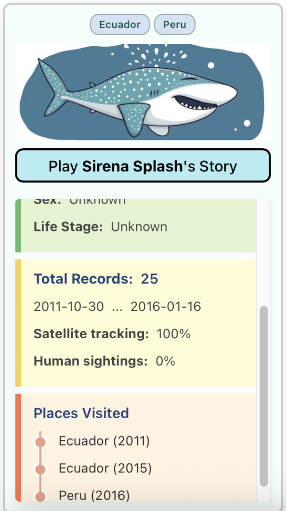
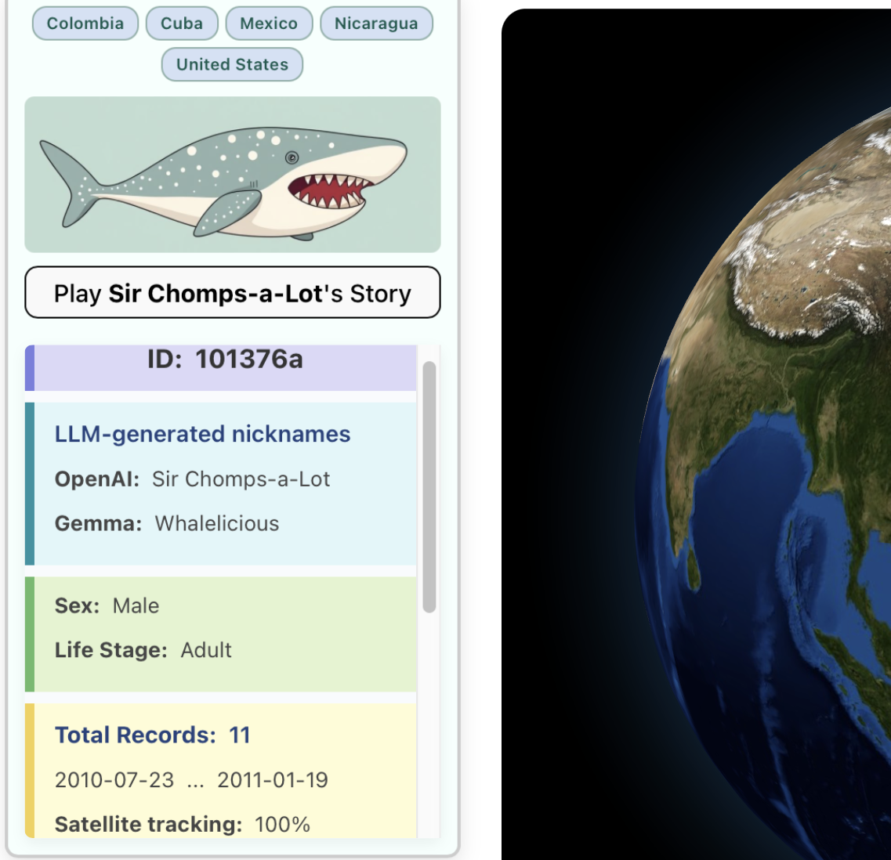
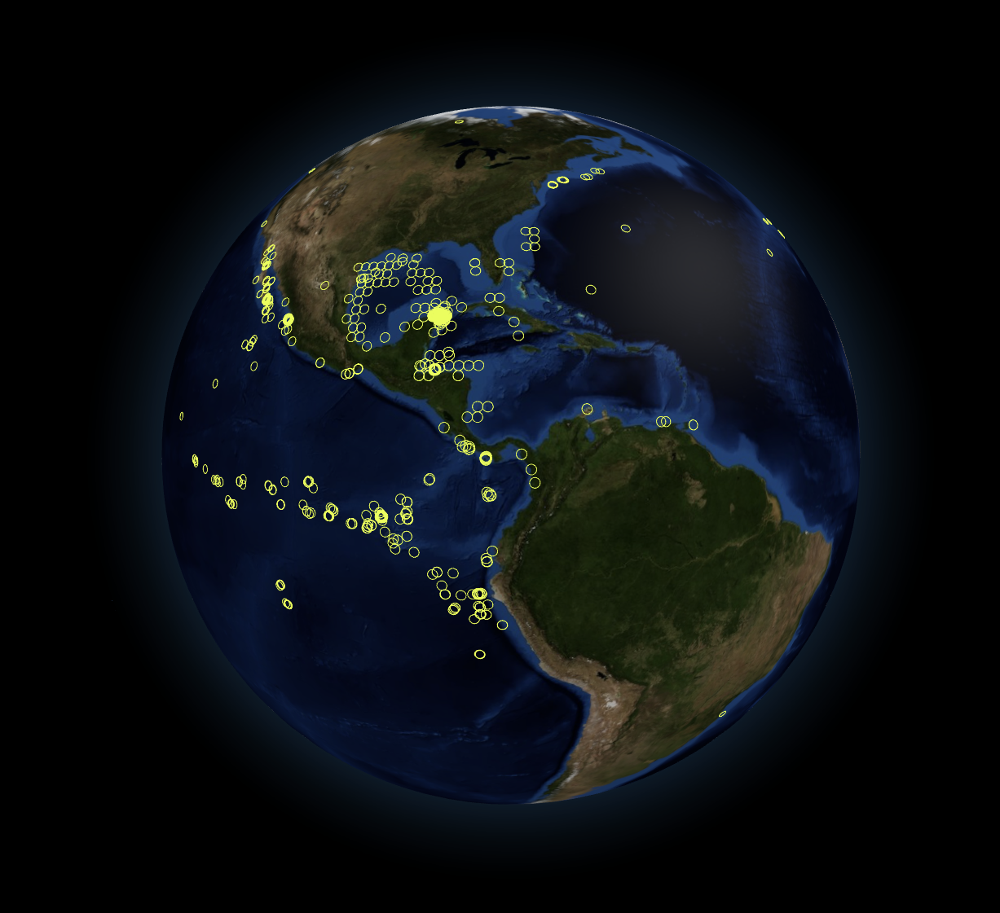

# 🐋 🦈 Whale Shark Master Site

May 2025 update.. this web app is now **LIVE**! Still a WIP, but feel free to start exploring!

——>  **[https://aadriien.github.io/whale-shark-site](https://aadriien.github.io/whale-shark-site)**  <—— 

## Description

Take a deep dive into the world of gentle giants with this **master website of whale shark data**! 

For this project, `whale-shark-site`, I aim to bridge the gap between scientific research and everyday engagement by amassing shark, climate, and ocean data from a variety of sources—funneling them into one central site that can appeal to users of all backgrounds. 

## Table of Contents

- [Project Goals](#project-goals)
- [Technical Overview](#technical-overview)
- [How It Works](#how-it-works)
- [Features](#features)
- [Design Choices](#design-choices)
- [Video Demos](#video-demos)
- [Example Images](#example-images)
- [CV Model Training](#cv-model-training)
- [Acknowledgements](#acknowledgements)

## Project Goals

While this platform is inherently educational, I want it to also be **accessible and exciting**. It should mirror the feeling you experience when you step inside a really interesting museum, or a particularly impressive library. This master site of whale shark data is a kind of playground. It's meant to be **discovered and explored**.

This is a **work in progress**, but I can assure you that I'm fit to burst with ideas and plans! A project of this nature is a huge undertaking, with many moving pieces, so please hang tight while I chip away. 🚀 

In the meantime, feel free to explore the codebase and/or reach out with any questions. 

## Technical Overview

### Data Sources

- **GBIF**: Biodiversity data (whale shark records)

- **NASA**: Climate and Earth data

- **Copernicus**: Ocean and marine data

### Tech Stack

- **Python**: APIs + data pipelines

- **Vite + React**: Web app

- **JavaScript + TypeScript**: Under the hood web utils 

- **Three.js (+ WebGL)**: 3D web graphics

- **P5.js + D3.js**: Interactive web + data visuals

- **PyTorch**: Computer vision model training

- **Pandas + NumPy**: Data pipelines + computer vision

- **LLMs (Mistral, Gemma, OpenAI GPT)**: Generative AI (shark names + cartoons)

### Computer Vision

- **YOLOv8**: Ultralytics model for object detection — starting with COCO, & training model myself

- **MiewID-msv3**: Hugging Face model to identify specific organism (who is this shark) — also training

- Visit [computer-vision](./computer-vision/README.md) subfolder for additional details & acknowledgements!

## How It Works

### Data pipelines (ETL)

1. Data fetched from API endpoints

2. Data cleaned, prepped, aggragated, and analyzed

3. Data stored and summoned for web use

### Website (web app)

1. Pages dedicated to different audiences

    - **Science and research** (data + detail)

    - **Fun and play** (interaction + connection)

2. Insight from data pipelines pulled in to web pages

3. JavaScript libraries prettify content for user engagement

## Features

- **🌍 Realistic Earth models**: Three.js globes built for discovery, to explore the data.
- **🛰️ Satellite tracking by tag**: Mapping of where the sharks have been, and where they are going.

- **🦈 Individual shark cards**: Personal detailing of various whale sharks worldwide.
- **🤿 Personal diver stories**: Records and takeaways from divers who have encountered them.

- **💻 Computer vision matching**: Integration of a really neat open source Hugging Face model.
- **🎨 Build-A-Shark LLM creation**: Unique customization of a whale shark cartoon using generative AI.

- **📊 Historic data trends**: Holistic insights into the sharks (+ related factors) over time.
- **📸 Real media and clean visuals**: Pictures, videos, and plenty of thoughtful visualizations.

## Design Choices

- **Modular separation**: Careful isolation of data pipelines and web processes to keep things clear.

- **Reusable pieces**: Features that are built iteratively and with maximum flexibility for later reuse.

- **Functional scalability**: Efficient data storage and web organization for long-term expansion.

- **Playful education**: Plenty to learn, but with exploration and engagement as the primary goal.

## Video Demos

🌊 3D Model Swimming Animation   |   🌐 Tracker Page Globe Storytelling
:-------------------------------:|:-------------------------------:
  |  

🌌 Whale Shark Home Page Welcome   |   🪐 Pulsing 3D Shark
:-------------------------------:|:-------------------------------:
   |  

## Example Images

📝 Shark Details   |   🪪 Individual Shark Card   |   📱 Story Sharks Grid
:-------------------------:|:-------------------------:|:-------------------------:
  |    |  

📖 Shark Story in Progress   |   📍 Geo-Mapping Globe View
:-------------------------:|:-------------------------:
  |  

⭐️ Saved Sharks in Logbook   |   💾 Condensed Helper Logbook
:-------------------------:|:-------------------------:
  |  

🎢 Animation Path Creation 
:-------------------------:
 

<table>
    <tr>
        <td colspan="3" style="text-align: center;">
            
            
        </td>
    </tr>
    <tr>
        <td></td>
        <td></td>
        <td></td>
    </tr>
</table>

## CV Model Training

🧩 YOLOv8 Model (Baseline COCO)   |   🧠 YOLOv8 Model (Training Runs)
:-------------------------------:|:-------------------------------:
  |  

## Acknowledgements

### People

A massive thank you to the wonderful community of builders, creators, and programmers at [the Recurse Center](https://www.recurse.com)! Much of this project has been developed during my time at RC, and I'm continually inspired by the energy and passion of those around me.

Thank you to Anastasia from the [Wild Me](https://www.wildme.org) support team for chatting with me about [Sharkbook](https://www.sharkbook.ai), and for sharing open source resources like Wildbook's [Image Analysis](https://github.com/WildMeOrg/wildbook-ia) software!

Thank you to Leïla from the [Copernicus Marine](https://marine.copernicus.eu) support team for helping me troubleshoot the capabilities of the [MyOcean Pro Viewer](https://marine.copernicus.eu/access-data/ocean-visualisation-tools) in relation to 3rd party data imports!

### APIs & Data

I used biodiversity data from [GBIF](https://www.gbif.org) to access whale shark records.

I used the MyOcean Pro embedded viewer from [Copernicus Marine](https://marine.copernicus.eu) to visualize ocean data.

I used [Pollinations.AI](https://pollinations.ai)'s API to access OpenAI text + image generation.

### Libraries & Modules

Thank you to Sean Bradley, whose open source [JEasings module](https://github.com/Sean-Bradley/JEasings), a JavaScript animation engine, allows me to control movements on the Three.js globe for "storytelling mode".

### 3D Model Credits

["Whale Shark Fantasy"](https://skfb.ly/6ysSQ) by Alenzo is licensed under [Creative Commons Attribution](http://creativecommons.org/licenses/by/4.0/).

